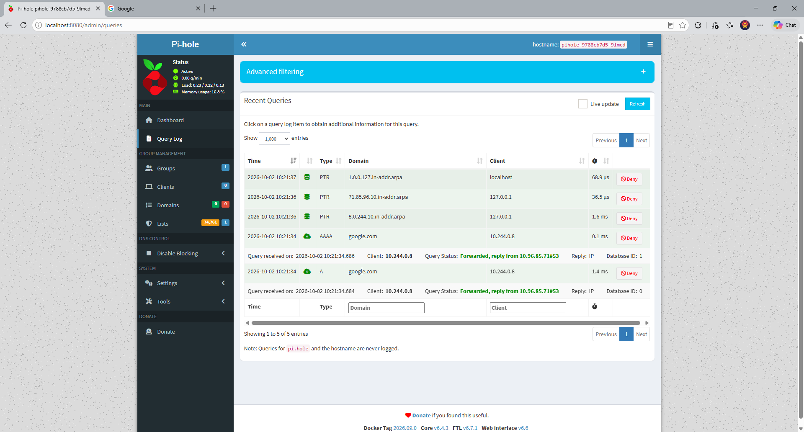

# Pi-hole + Unbound on Kubernetes (Kind)

Migration of my Docker Compose Pi-hole setup (Nav546/pihole-docker) to Kubernetes.

## Architecture
Client pod -> Pi-hole (Service: pihole) -> Unbound (Service: unbound, ClusterIP) -> internet

## What it demonstrates
- Deployments and ClusterIP Services for Pi-hole and Unbound
- Pi-hole upstream set to Unbound via the injected service env var
- Admin password stored in a Kubernetes Secret (not in git)
- NetworkPolicy so only Pi-hole can reach Unbound on port 53
- Verified: direct query to Unbound from a test pod times out, query via Pi-hole succeeds

## Run it
    kind create cluster --name pihole
    kubectl apply -f manifests/unbound.yaml
    kubectl create secret generic pihole-secret --from-literal=password='CHANGE_ME'
    kubectl apply -f manifests/pihole.yaml
    kubectl apply -f manifests/unbound-netpol.yaml
    kubectl port-forward svc/pihole 8080:80   # http://localhost:8080/admin

> Apply Unbound before Pi-hole. Pi-hole gets Unbound's address from the `UNBOUND_SERVICE_HOST` variable, which Kubernetes only injects into pods created after the Service exists.

## Verify the NetworkPolicy
Direct query to Unbound from a random pod (should time out):

    kubectl run dnstest --rm -it --image=busybox:1.36 --restart=Never -- timeout 10 nslookup google.com unbound

Query through Pi-hole (should resolve):

    kubectl run dnstest --rm -it --image=busybox:1.36 --restart=Never -- nslookup wikipedia.org pihole

## Proof it works
Pi-hole query log: the lookup from the test pod is forwarded to Unbound's ClusterIP (10.96.85.71#53).

